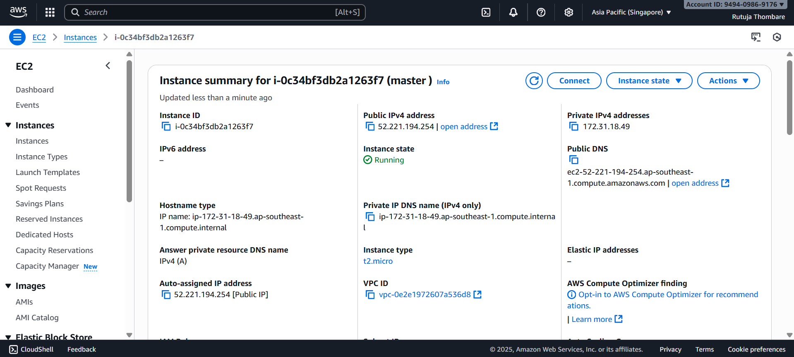
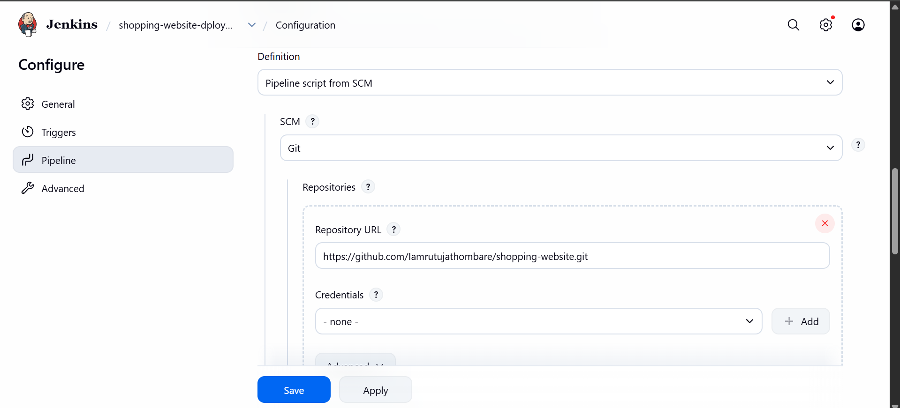
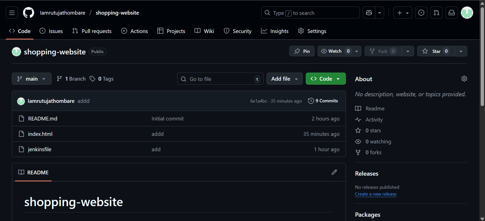
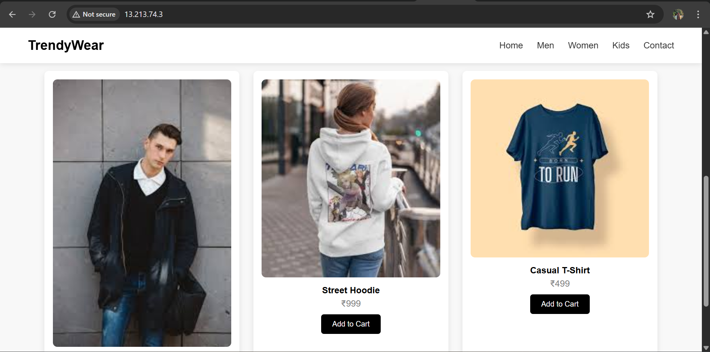

# Shopping Website Deployment Guide (Ubuntu + Jenkins + EC2)

This guide explains how to deploy a simple **HTML-based shopping website** using:
- GitHub (Code Storage)
- Jenkins (CI/CD Automation)
- Ubuntu EC2 Deployment Server (Web Hosting with Apache)

No Docker and no Maven required.

---

## 1. Project Files
Your project should contain:
```
shopping-website/
 ├─ index.html
 └─ README.md
```

### `index.html`
```
<!DOCTYPE html>
<!DOCTYPE html>
<html lang="en">
<head>
<meta charset="UTF-8">
<title>TrendyWear - Fashion Collection</title>

<style>
body { margin: 0; font-family: 'Poppins', sans-serif; background: #f8f8f8; }

.navbar {
  display: flex; justify-content: space-between; align-items: center;
  padding: 18px 50px; background: white; box-shadow: 0 2px 10px rgba(0,0,0,0.1);
  position: sticky; top: 0; z-index: 10;
}
.navbar h2 { margin: 0; font-size: 24px; color: black; }
.navbar ul { list-style: none; display: flex; gap: 25px; margin: 0; padding: 0; }
.navbar li { cursor: pointer; color: #333; font-weight: 500; }
.navbar li:hover { color: #000; }

.hero {
  height: 85vh;
  background: url('https://i.pinimg.com/1200x/b6/75/9e/b6759e4d83595415a6604ab382b22479.jpg') center/cover no-repeat;
  display: flex; justify-content: center; align-items: center; text-align: center; color: white;
}
.hero h1 { font-size: 50px; margin-bottom: 10px; }
.hero p { font-size: 18px; margin-bottom: 20px; }
.hero button {
  background: black; color: white; border: none; padding: 14px 25px; cursor: pointer;
  font-size: 16px; border-radius: 4px;
}
.hero button:hover { background: #444; }

.products {
  padding: 50px 80px;
}
.products h2 { text-align: center; margin-bottom: 40px; }
.grid {
  display: grid; grid-template-columns: repeat(auto-fit, minmax(220px, 1fr)); gap: 25px;
}
.card {
  background: white; border-radius: 8px; padding: 15px; text-align: center;
  box-shadow: 0 4px 10px rgba(0,0,0,0.1);
}
.card img { width: 100%; border-radius: 8px; }
.card h4 { margin: 10px 0 5px; }
.card p { color: gray; margin: 0; }
.card button {
  margin-top: 10px; background: black; color: white; border: none;
  padding: 10px 20px; cursor: pointer; border-radius: 5px;
}
.card button:hover { background: #444; }
</style>

</head>
<body>

<!-- Navbar -->
<div class="navbar">
  <h2>TrendyWear</h2>
  <ul>
    <li>Home</li>
    <li>Men</li>
    <li>Women</li>
    <li>Kids</li>
    <li>Contact</li>
  </ul>
</div>

<!-- Hero Section -->
<div class="hero">
  <div>
    <h1>New Classic Collection</h1>
    <p>Stay stylish and warm with our latest arrivals.</p>
    <button>Shop Now</button>
  </div>
</div>

<!-- Products Section -->
<div class="products">
  <h2>Featured Products</h2>
  <div class="grid">

    <div class="card">
      
      <h4>Classic Jacket</h4>
      <p>₹499</p>
      <button>Add to Cart</button>
    </div>

    <div class="card">
      
      <h4>Street Hoodie</h4>
      <p>₹999</p>
      <button>Add to Cart</button>
    </div>

    <div class="card">
      
      <h4>Casual T-Shirt</h4>
      <p>₹499</p>
      <button>Add to Cart</button>
    </div>

  </div>
</div>

</body>
</html>

```

Upload this folder to a GitHub repo:
```
https://github.com/Iamrutujathombare/shopping-website.git
```

---

## 2. Launch EC2 Deployment Server
1. Go to AWS EC2 → Launch Instance
2. Select **Ubuntu 22.04**
3. Instance Type: `t2.micro`
4. Create Key Pair & Download `.pem`
5. Allow **port 22, 80** in security group
6. Launch the instance


### Connect to Server
```
chmod 400 yourkey.pem
ssh -i yourkey.pem ubuntu@EC2_PUBLIC_IP
```

### Install Apache Web Server
```
sudo apt update
sudo apt install apache2 -y
sudo systemctl enable apache2
sudo systemctl start apache2
```

### Project Deployment Directory
```
sudo rm /var/www/html/index.html
sudo nano /var/www/html/index.html
# Paste your HTML content here and save it
```

Visit:
```
http://13.213.74.3
```

Your website is live.

---

## 3. Launch Jenkins Server (CI/CD)
Launch **another EC2 instance** (Ubuntu) to be the Jenkins server.



### Install Jenkins
```
sudo apt update
sudo apt install openjdk-17-jdk -y
curl -fsSL https://pkg.jenkins.io/debian-stable/jenkins.io.key | sudo tee   /usr/share/keyrings/jenkins-keyring.asc > /dev/null
echo deb [signed-by=/usr/share/keyrings/jenkins-keyring.asc]   https://pkg.jenkins.io/debian-stable binary/ | sudo tee   /etc/apt/sources.list.d/jenkins.list > /dev/null
sudo apt update
sudo apt install jenkins -y
sudo systemctl enable jenkins
sudo systemctl start jenkins
```

Access Jenkins UI:
```
http://JENKINS_SERVER_PUBLIC_IP:8080
```

### Unlock Jenkins
```
sudo cat /var/lib/jenkins/secrets/initialAdminPassword
```

Install recommended plugins.

---

## 4. Configure SSH Authentication (Jenkins to Deployment EC2)
On Jenkins Server:
```
ssh-keygen -t rsa
```
Press Enter for all prompts.

Copy key to Deployment Server:
```
ssh-copy-id ubuntu@DEPLOYMENT_SERVER_IP
```

Verify:
```
ssh ubuntu@DEPLOYMENT_SERVER_IP
```

---

## 5. Create Jenkins Pipeline Job

Go to Jenkins:
```
New Item → Pipeline → OK
```




### Pipeline Script (Jenkinsfile)
Paste:
```
pipeline {
    agent any

    stages {
        stage('Checkout') {
            steps {
                git branch: 'main', url: 'https://github.com/Iamrutujathombare/shopping-website.git'
            }
        }

        stage('Deploy to Server') {
            steps {
                sshagent(['node-key']) {
                    sh """
                    ssh -o StrictHostKeyChecking=no ubuntu@13.213.74.3 "sudo rm -rf /var/www/html/*"
                    scp -o StrictHostKeyChecking=no -r * ubuntu@13.213.74.3:/home/ubuntu/website/
                    ssh -o StrictHostKeyChecking=no ubuntu@13.213.74.3 "sudo cp -r /home/ubuntu/website/* /var/www/html/"
                    """
                }
            }
        }
    }
}
```

Save and Run Build.

```
```
## 6.Git hub repository




```
```


## 7. Validate Deployment
Open:
```
http://13.213.74.3/
```

You will see your live website.
## Result



---

## 8. To Update Website
Just edit `index.html` → Git Commit → Jenkins auto deploys.

---

## DONE ✅
Your CI/CD + Website Deployment is fully working.

 ## 👨‍💻 Author
**Rutuja Thombare**  
🌐 [LinkedIn](https://www.linkedin.com/in/iamrutujathombare)  
📧 rutujathombare7387@gmail.com 
